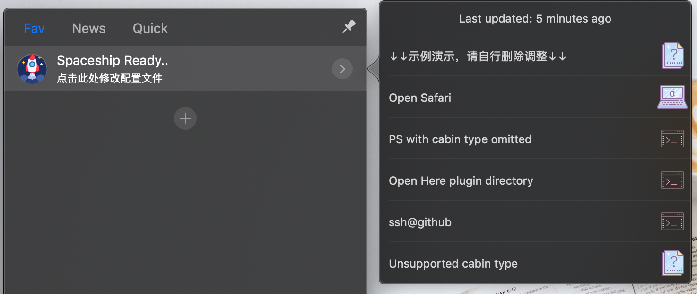

# Spaceship

> A simple shortcut [Here](https://here.app) plugin. inspired by shuttle

[中文说明](./README_zh.md)

## Installation

### One Click  (Recommend)

👉 <a href="https://jump.here.app/?installPlugin?title=Spaceship&url=https://github.com/FriendsOfHere/spaceship/releases/latest/download/Spaceship.hereplugin">Click Here 🔌</a>

### Manually
1. Go [releases](https://github.com/FriendsOfHere/spaceship/releases/latest/) page
2. Download the latest release & double click the `Spaceship.hereplugin`

## Feature
- Add your own shortcuts
- Easy configuration file
- Support different type of shortcuts

## Usage
- Enable the plugin and click `spaceship` in mini window to quick edit `~/.spaceship.json`
- Save & Restart `here` or Reload `spaceship`

## Configuration options
> see `_comments` section in `./src/template/spaceship.json`

## License
This plugin is published under the [MIT License](./LICENSE.md)
